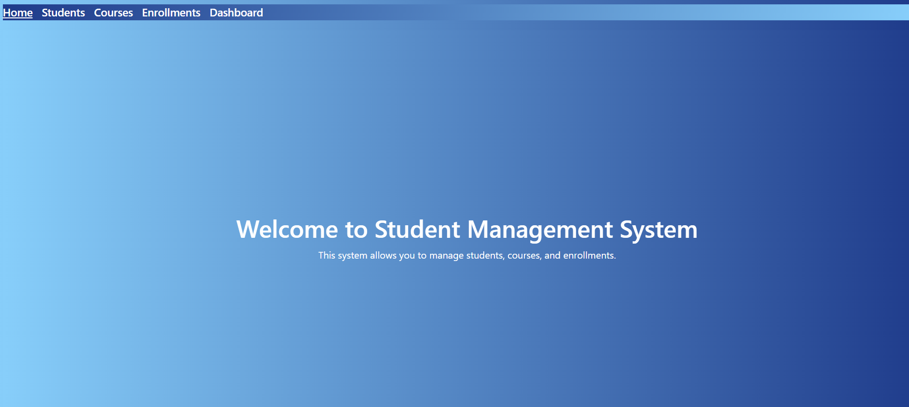
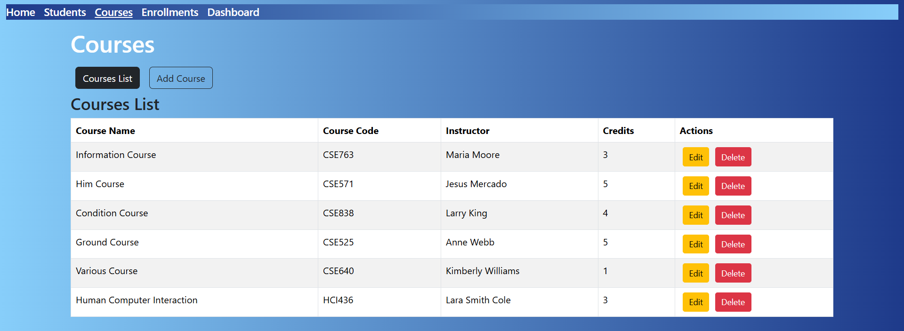
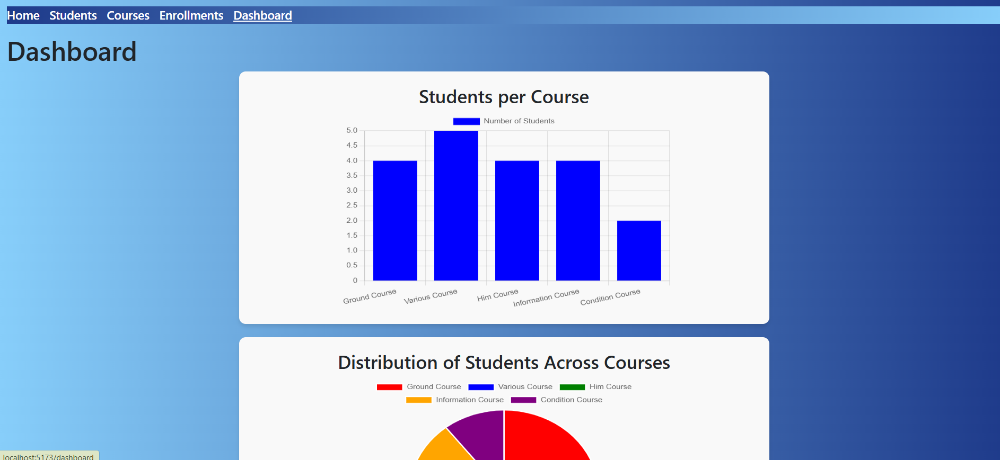
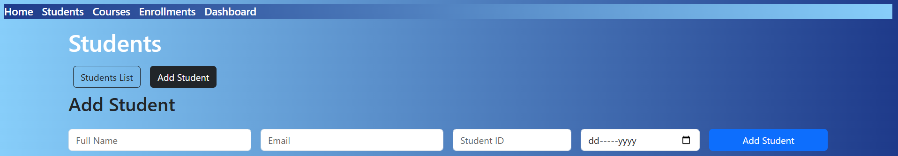

## Backend Project Git Repository URL
since I don't know how to use Docker that's why I created separate git repositories for frontend and backend.
Below I am adding link to backend repository.
`https://github.com/Aliza05/studentManagementSystemBackend.git`
If I would be given a chance I will learn Docker and integrate it too.

## For this challenge I have used Django Rest Framework and Vue.js.
There is a README file in backend repository too, explaining the backend setup.

# Student Management System Frontend

This guide walks you through setting up and running the Vue.js project.

## Prerequisites

Ensure you have the following installed on your system:

- [Node.js](https://nodejs.org/) (version 16 or later)
- [npm](https://www.npmjs.com/) or [Yarn](https://yarnpkg.com/)

## Installation

1. **Clone the Repository**
   ```sh
   git clone https://github.com/Aliza05/studentManagementSystemFrontend.git

2. **Install libraries**
    ```sh
    npm install

3. **Run the project**
    ```sh
    npm run dev
   
## If I had more time
then I would definitely learn Dockerfiles, how they work, how to integrate them and must have used them in order to set-up the project.

## I am adding a few screenshots of the UI below 








